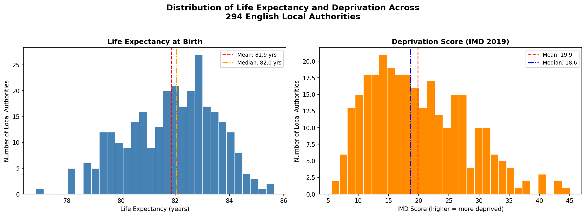
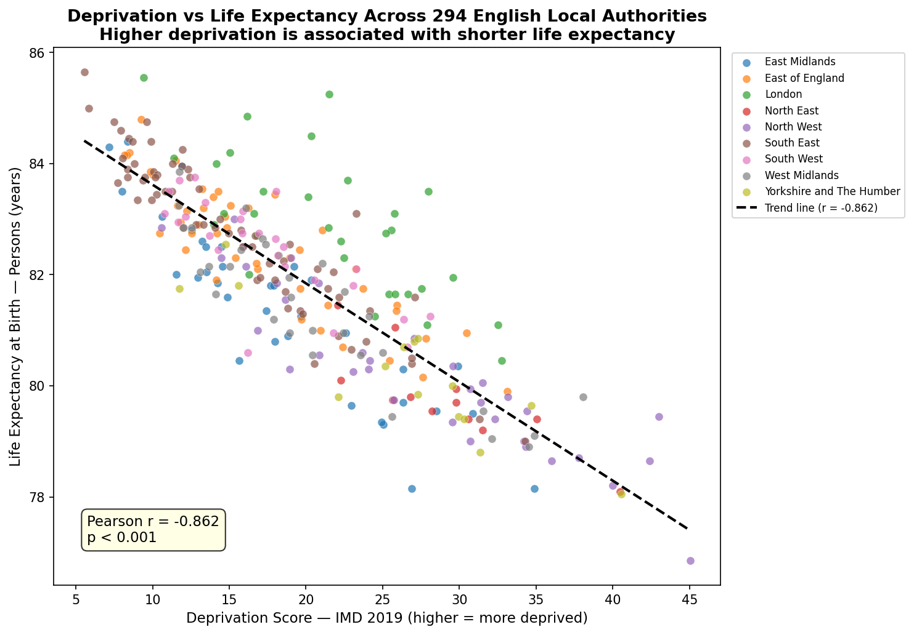
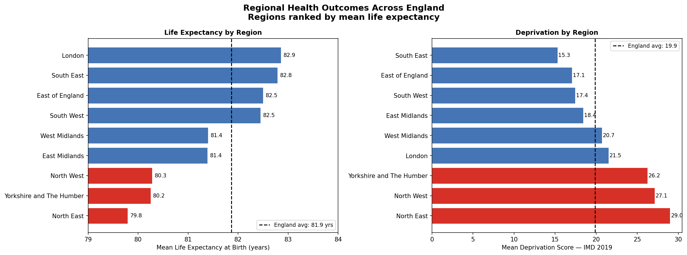
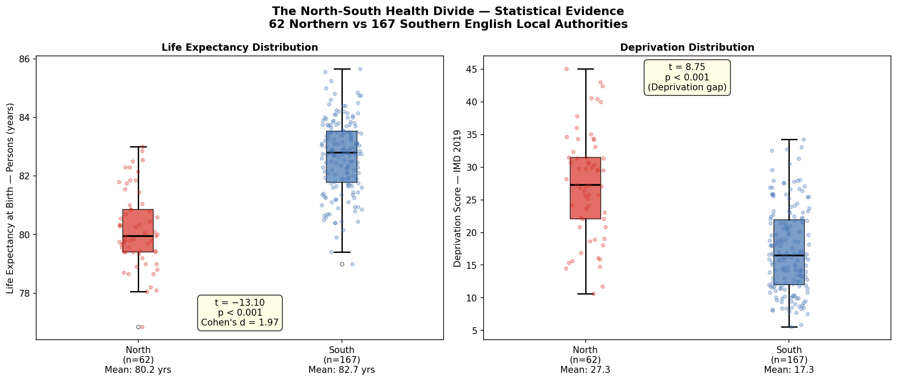

# Project 02 — NHS Regional Health Outcomes


## Overview

A statistical analysis of regional health outcome variation across
294 English local authorities, using OHID Fingertips Local Authority
Health Profiles data. This project examines the relationship between
deprivation and life expectancy, quantifies the North-South health
divide, and communicates findings as a structured policy briefing
for a non-technical public health audience.

**Civil Service Behaviour demonstrated:** Communicating and
Influencing at HEO/SEO level — translating complex statistical
findings into clear, audience-appropriate policy recommendations
for a Director of Public Health.

---

## Key Findings

### Finding 1 — Deprivation is the dominant predictor of life expectancy

> Pearson r = −0.862 | p < 0.001 | Slope = −0.178 years per IMD point

Deprivation score alone explains **74% of the variance** in life
expectancy across 294 English local authorities. For every one-point
rise in IMD score, life expectancy falls by approximately **65 days**.
Across the full deprivation range in England, this translates to a
predicted gap of **7.1 years** of life between the least and most
deprived areas.

### Finding 2 — The North-South health divide is statistically proven

> t = −13.10 | p < 0.001 | Cohen's d = 1.975 (Very Large)

Northern local authorities (North East, North West, Yorkshire) have
a mean life expectancy of **80.18 years** — **2.49 years below**
Southern authorities (82.67 years). The average Southern local
authority has higher life expectancy than **98% of Northern local
authorities**. This is one of the largest structural health
inequalities in English public health data.

### Finding 3 — The London Health Paradox

Despite above-average deprivation (mean IMD = 21.5 vs England
average 19.9), London has the **highest mean life expectancy**
of any English region (82.9 years). London boroughs consistently
sit above the national deprivation-life expectancy trend line —
suggesting deprivation operates differently in the capital.
National deprivation-based funding formulae should not be applied
uniformly across London and non-London areas.

### Finding 4 — Child poverty in the North is double the Southern rate

Yorkshire (29.7%) and North East (28.8%) child poverty rates are
approximately **double** those of the South East (14.4%). This
structural economic inequality is likely to perpetuate the
North-South health divide for decades without targeted early
intervention.

---

## Visualisations

### Distribution of Life Expectancy and Deprivation



### Deprivation vs Life Expectancy — 294 Local Authorities



### Regional Health Outcomes



### The North-South Divide — Statistical Evidence



---

## Dataset

| Source          | Dataset                         | Access                         |
| --------------- | ------------------------------- | ------------------------------ |
| OHID Fingertips | Local Authority Health Profiles | Public — fingertips.phe.org.uk |
| ONS via ArcGIS  | LAD-to-Region Lookup 2024       | Public — ONS Geography API     |

**Coverage:** 294 English local authorities (Districts & Unitary
Authorities, from April 2023 boundaries)

**Key indicators used:**

- Life expectancy at birth (Male, Female, Persons) — 2024
- Deprivation score (IMD 2019)
- Under-75 mortality rate from all causes — 2024
- Smoking prevalence in adults — 2024
- Overweight/obesity prevalence in adults — 2023/24
- Employment rate (16-64) — 2024/25
- Children in relative low income families — 2023/24

---

## Methods

### New techniques introduced in this project

| Technique                       | Description                                              |
| ------------------------------- | -------------------------------------------------------- |
| Bivariate analysis              | Examining relationships between pairs of variables       |
| Pearson correlation             | Measuring strength and direction of linear relationships |
| `df.corr()`                     | Computing correlation matrices in pandas                 |
| Seaborn scatter with regression | Visualising bivariate relationships                      |
| `groupby().agg()`               | Multi-function regional aggregation                      |
| Welch's t-test                  | Comparing means between two independent groups           |
| Cohen's d                       | Quantifying practical effect size                        |
| `pivot_table()`                 | Reshaping long-format data to wide analytical table      |
| fingertips_py API               | Programmatic access to public health data                |
| ONS Geography API               | Local authority to region lookup                         |

### Mathematical foundations (derived by hand before coding)

All mathematical concepts were derived from first principles before
any library function was called:

- **Pearson r** — full formula derivation with worked 5-area example
- **Independent samples t-test** — formula, degrees of freedom
  (Welch's approximation), null and alternative hypotheses
- **Cohen's d** — pooled standard deviation formula
- **p-values** — definition, correct interpretation, common
  misinterpretations
- **Type I and Type II errors** — α, β, power framework

---

## Project Structure

```
project02-nhs-regional-health-outcomes/
├── data/
│   ├── raw/                  # Raw downloads — gitignored
│   └── processed/
│       ├── health_outcomes_wide.csv
│       └── health_outcomes_final.csv
├── notebooks/
│   └── 01_data_profiling.ipynb
├── outputs/
│   └── figures/
│       ├── 01_univariate_distributions.png
│       ├── 02_deprivation_vs_life_expectancy.png
│       ├── 03_regional_health_outcomes.png
│       └── 04_north_south_boxplot.png
├── .gitignore
└── README.md
```

---

## How to Reproduce

```bash
# 1. Clone the repository
git clone https://github.com/insightful-algorithms/project02-nhs-regional-health-outcomes.git
cd project02-nhs-regional-health-outcomes

# 2. Create and activate virtual environment
python -m venv ds_env
ds_env\Scripts\activate          # Windows
source ds_env/bin/activate        # Mac/Linux

# 3. Install dependencies
pip install numpy pandas matplotlib seaborn scipy jupyter \
            ipykernel notebook openpyxl fingertips_py

# 4. Launch Jupyter from project root
jupyter notebook

# 5. Open notebooks/01_data_profiling.ipynb and run all cells
#    Data is downloaded automatically via fingertips_py API
#    No manual data download required
```

---

_Portfolio: [github.com/insightful-algorithms](https://github.com/insightful-algorithms)_
